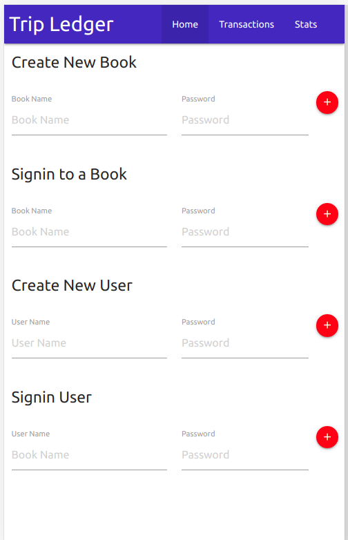
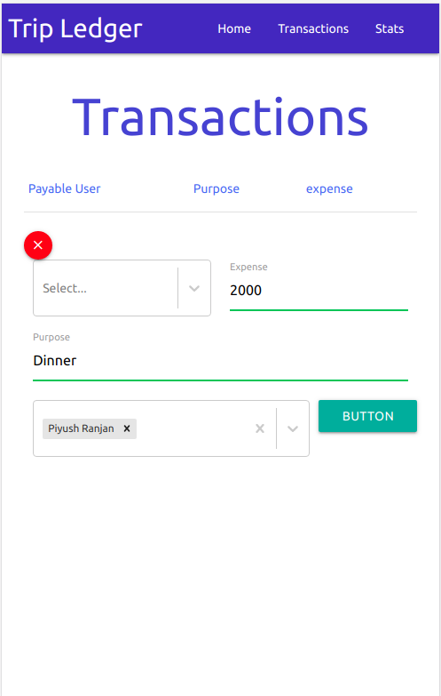
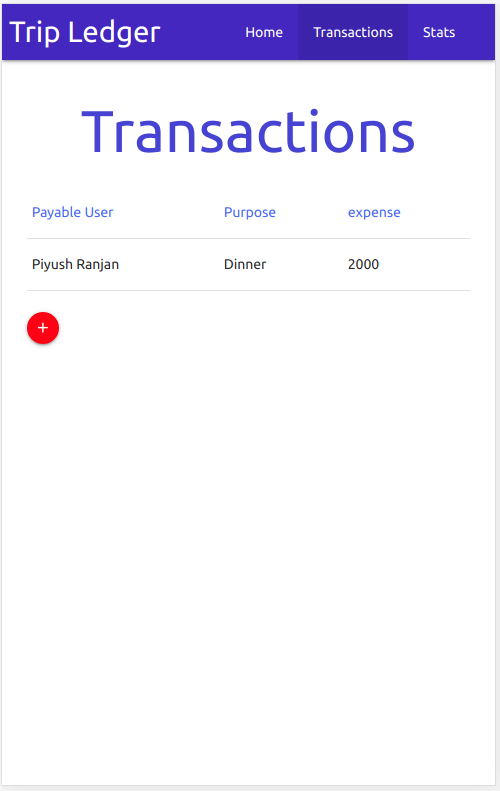

# Trip-Ledger
Have you ever faced difficulty in maintaining the tab of who spent on what and for whoam.
This webapp will solve all your problem.

Backend for creating and managing transaction using ExpressJS, mongodb for database management and ReactJS for frontend.

## Screenshots

### Home Page

### Transaction Page
Add new transaction to a logged in book.

Transaction Page.

  
